 
 

&nbsp;

&nbsp;

---

## 01 — PROFILE

### FRONTEND-MINDED · BACKEND-CAPABLE

I build modern web applications with a focus on **React.js, clean interfaces, REST APIs, and practical backend architecture**.

I enjoy turning ideas into responsive, maintainable products — from polished frontend experiences to structured backend systems.

---

## 02 — STACK

<table>
<tr>

<td width="33%" valign="top">

### FRONTEND

`React.js`  
`JavaScript ES6+`  
`HTML5`  
`CSS3`  
`Tailwind CSS`  
`Bootstrap`  
`Redux`  
`React Router`

</td>

<td width="33%" valign="top">

### BACKEND

`Node.js`  
`Express.js`  
`MongoDB`  
`Mongoose`  
`REST APIs`  
`Authentication`  
`API Integration`

</td>

<td width="33%" valign="top">

### TOOLS

`Git`  
`GitHub`  
`Figma`  
`Postman`  
`VS Code`  
`Vercel`

</td>

</tr>
</table>

 

---

## 03 — WHAT I BUILD

<table>
<tr>

<td width="33%" valign="top">

### WEB EXPERIENCES

Responsive interfaces, reusable components, routing, state management, and polished UI.

</td>

<td width="33%" valign="top">

### BACKEND SYSTEMS

REST APIs, authentication, validation, database integration, and structured application logic.

</td>

<td width="33%" valign="top">

### FULL-STACK PRODUCTS

Connecting frontend and backend into complete applications around real-world workflows.

</td>

</tr>
</table>

---

## 04 — SELECTED WORK

### BUILT TO SOLVE · DESIGNED TO SCALE

 

### EVENTORA

**Event Discovery Platform**

A modern event discovery experience powered by the Ticketmaster API.

`React.js` · `Tailwind CSS` · `Axios` · `React Router` · `Context API`

[Live Project ↗](https://eventora-event-platform-k5om.vercel.app/)  
[Source Code ↗](https://github.com/AmalMansour19/eventora-event-platform)

---

### TASTECRAFT

**Food & Recipe Experience**

A responsive food-focused web experience built around clean presentation and intuitive navigation.

`React.js` · `JavaScript` · `CSS`

[Live Project ↗](https://taste-craft-eight.vercel.app/)

---

### ADMIN DASHBOARD

**Store Management Interface**

A responsive dashboard focused on structured data presentation and practical management workflows.

`React.js` · `Tailwind CSS` · `REST API`

[Live Project ↗](https://dashboard-g2fbu90k7-amal-mansour.vercel.app/login)

---

### E-COMMERCE API

**Full-Stack Backend System**

A structured e-commerce REST API covering authentication, products, reviews, cart, wishlist, orders, and administrative functionality.

`Node.js` · `Express.js` · `MongoDB` · `Mongoose`

[Source Code ↗](https://github.com/AmalMansour19/e-commerce-backend)

---

## 05 — DEVELOPMENT APPROACH

<table>
<tr>

<td align="center" width="25%">

### STRUCTURE

Clean architecture  
Reusable components  
Maintainable code

</td>

<td align="center" width="25%">

### EXPERIENCE

Responsive UI  
Clear navigation  
Practical interactions

</td>

<td align="center" width="25%">

### ENGINEERING

REST APIs  
Validation  
Database integration

</td>

<td align="center" width="25%">

### GROWTH

Learn  
Build  
Refine  
Improve

</td>

</tr>
</table>

---

## 06 — GITHUB

 

 
 

---

## 07 — LET'S BUILD SOMETHING

### Turning ideas into products worth using.

 

 
 

<a href="mailto:elhayaa28@gmail.com">EMAIL</a>
&nbsp; · &nbsp;
<a href="https://www.linkedin.com/in/amalmansour20/">LINKEDIN</a>
&nbsp; · &nbsp;
<a href="https://github.com/AmalMansour19">GITHUB</a>

 
 

Design with intention · Build with purpose · Keep improving

